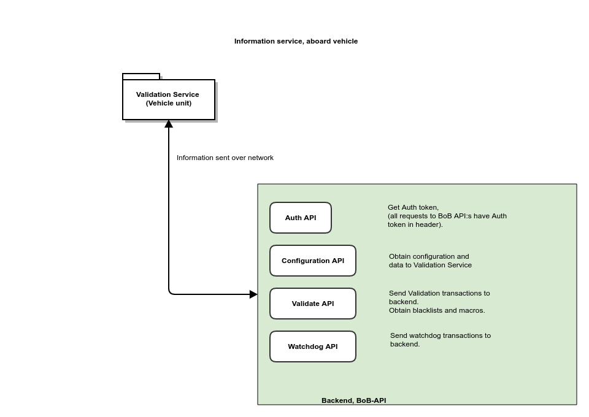

# Data provision for Validation Service aboard

## General information

Validation Service aboard is the device that reads and interprets the ticket "blipped" by the traveller when embarking. Included in the Validation Service concept is also a software programme to view the validated ticket on a drivers display.

Validation Service checks that the scanned ticket is authentic and not copied. This is for example done by checking the cryptographical signatures. Validation Service also check the ticket validity regarding time and place.

Validation Service then publish the validation over MQTT in the vehicle network, so that it can be displayed on the driver's monitor, as well as over audio and light signal on the ticket scanner.

To be able to do this, Validation Service need external data in terms of time and place. Time is handled in the operation system with NTP (Network Time Protocol). Place is a concept relative to the information included in the tickle-data in the ticket.

## The validation process

The geographical validity of a ticket is verified according to the following steps:

- Firstly, the zonal validity for the current stop is checked (if the current stop is located within two zones the ticket must be valid in at least one of them)

- Secondly, the zone of the next stop is checked. If this is a different zone than the current one, the ticket must be valid in the other zone as well. This is to prevent a ticket from being marked as valid if a traveller embarks the vehicle on the last stop before a zonal change.

In addition to valid zone, the ticket's validity time is controlled in relation to the current time.

Not valid ticket is signalled with "Bad Read" on the scanner, typically a flashing red light and a angry signal. Valid ticket can be signalled in two different ways. If the traveller category is one (1) adult (= normal) "Good read" is signalled, typically a green flash and a happier signal on the buzzer. All other valid tickets are signalled with "Good other", same audio as "Good read" but with more colours on the lights besides green. The drivers monitor has the same visual signals.

## Driver's monitor

Driver's monitor is in this case refers to the information provided by the Validation Service.

In addition to the graphical display of the ticket information, the correct time and the position of the vehicle in terms of service, stop, and zone are displayed on the drivers monitor.

The drivers monitor get all information over MQTT from Validation Service, except that concerning the current time.

# Requirements of services in the Vehicle network

Vehicle network in this case refers to the physical network aboard the vehicle, including its service suppliers. The placement of these services is unimportant from the aspect of the Validation Service.

## Time

Correct time is obtained and synchronised over the Internet.

Correct time is synchronised over the NTP protocol to Validation Service at system start and is further held with ntpd. Both these functions are at OS-level and does not affect the application directly.

## Position (place)

Position is used to expand the information to be validated. In other words must at least the same information used in the Tickle-sentence also be accessible to the Validation Service.

All information concerning place is obtained over MQTT in the Vehicle network. Telegrams shall be JSON encoded as UTF-8.

All The following telegrams are used:

### GPS

- **GPS** (NMEA 0183), Position is published as a NMEA0183-sentence in the format \$GPRMC (Recommended minimum specific GPS/Transit data).

GPS should not be updated with a frequency higher than 1 (one) hertz. A preferable resolution is about every 5th second.

GPS is expected to be published on a separate topic with en separate topic with \$GPRMC as starting header in the string.

Example of an \$GPRMC-string:

    \$GPRMC,150000,A,5654.660,N,01432.52,E,3.14,90,241216,1.2,E,A\*3E

### Journey

**Journey** (Service), Includes service number (linjenummer) and destination. Service is normally not used as validation term but is sent together with other data in transactions to backend for statistics. 

Journey-telegram should be sent in connection to when the Vehicle is signposted, so that the drivers monitor can display the same information as the vehicle sign. 

Journey-telegram should after that be sent out approx every 30 sec.

*Source: [../schemata/journey.yaml](../schemata/journey.yaml)*

### Last stop

**Last stop** (current stop), contains the unique id (e.g., GID), name of the stop (to be displayed on the drivers monitor and zone-id and zone name. If the stop is connected to more than one zone (called "omlottzon") all zones shall be included with their zone-ids and zone names. 

LastStop telegrams should be sent in connection to the vehicle arriving at the stop.

*Source: [../schemata/last_stop.yaml](../schemata/last_stop.yaml)*

### Next stop

**Next stop** contains same information as **last stop** but concerning the approaching stop. Next stop should be sent in connection to lastStop.

*Source: [../schemata/next_stop.yaml](../schemata/next_stop.yaml)*

### At stop

**At stop** contains a boolean value True/False depending if the vehicle is at a stop or not. This information is used to adjust the backlight on the drivers monitor. 

AtStop-telegrams should be sent when the state is changed, typically when a vehicle arrives to and departures from a stop.

*Source: [../schemata/at_stop.yaml](../schemata/at_stop.yaml)*

## Publication of validation over MQTT

Validation Service publish validation information in a pre-formatted text version over MQTT in the vehicle internal network. This information is used by the drivers monitor included in Validation Service or by other software to view validation information.

In connection to a validation two telegrams are published, see below.

### Latest ticket
**Latest ticket** contains the pre-formatted text version of the last validated ticket in actual validator.

*Source: [../schemata/latest_ticket.yaml](../schemata/latest_ticket.yaml)*

### Status
**status** containing place information etc. Status is published in relation to events such as a new stop, new service etc. in order to keep the information on the drivers monitor updated.

*Source: [../schemata/status.yaml](../schemata/status.yaml)*

All strings in both telegram types are encoded as UTF-8.

## MQTT topics

To get the MQTT service aboard there is a need of an MQTT broker. From Validation Service view are there no requirements of where (in which hardware) that MQTT broker is deployed.

The MQTT broker is expected to listen on MQTT standard port, 1883.

Preferably are if the following topics can be used:

| Schema        | MQTT Topic                        | Direction |
| ------------- | --------------------------------- | --------- |
| none          | /service/gps/rmc                  | in        |
| journey       | /service/v1/journey               | in        |
| at_stop       | /service/v1/atStop                | in        |
| last_stop     | /service/v1/lastStop              | in        |
| next_stop     | /service/v1/nextStop              | in        |
| latest_ticket | /service/v1/Validate/latestticket | out       |
| status        | /service/v1/Validate/status       | out       |

# Requirements of communication with backend

Validation Service communicates with backend at typically startup and at every transaction. Communication is made through ssh and rsync (encrypted over ssh) to handle programs and data providing and through the BoB API:s, which are a RESTful API over TLS.

At boot the host handshakes with backend and check program versions. A possibly download of new packages and configuration data can be made. At upstart of Validation Service, a connection to backend is made to receive a Auth-token (JWT) from BoB Auth Endpoint.

After the start-up of Validation Service, all communications are made asynchronous and are queued in the transaction manager of Validation Service.

Communication shall be based on TCP/IP. Validation Service handles both IPv4 and IPv6 seamlessly. The IP addressing can be static or over DHCP, although DHCP is preferred. If static IP is used, the units for Validation Service should have the same IP-address regardless of which vehicle. E.g., the vehicle network use NAT or corresponding address translation.

The vehicle shall have a gateway that TCP-sessions can be established between every vehicle and backend. If the vehicle is moving between different systems the Validation Service needs to be able to reach backend API:s I for each of these systems. This can be made by a proxy in Validation Service backend.
